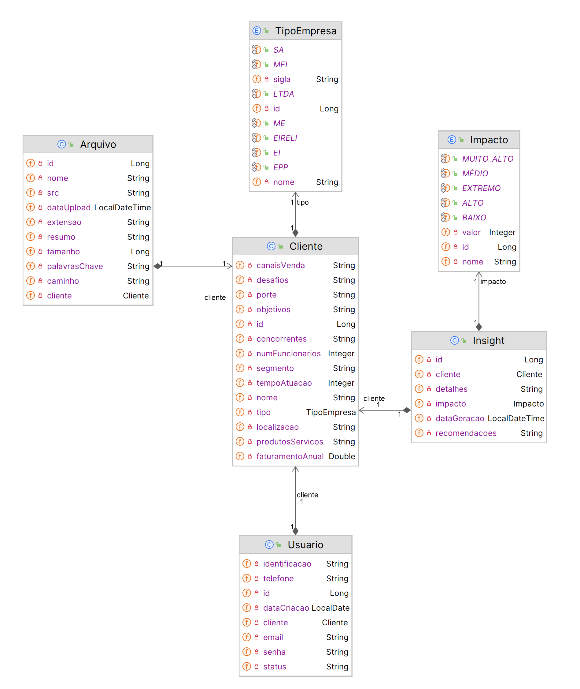
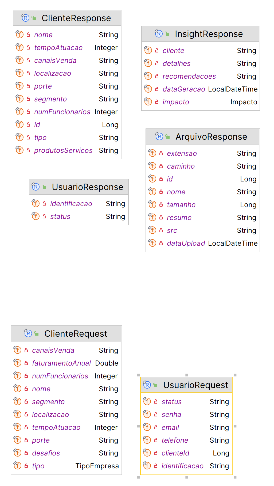
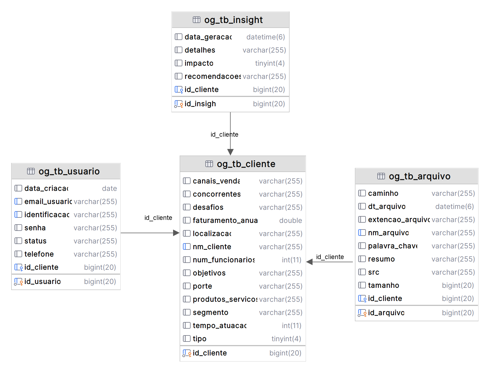

# OpenGroupAPI

| INTEGRANTES                    | RM      | 
|--------------------------------|---------|
| Amanda Bomfim De Oliveira      | RM99741 |
| Cauã Alencar Rojas Romero      | RM98638 |   
| Jaci Teixeira Santos           | RM99627 | 
| Leonardo dos Santos Guerra     | RM99738 | 
| Maria Eduarda Ferreira da Mata | RM99004 | 

## LINK DO REPOSITORIO NO GITHUB
[Link](https://github.com/jaciteixeira/OpenGroupAPI)

## SUMÁRIO

[EXPLICANDO A APLICAÇÃO](##_EXPLICANDO_A_APLICAÇÃO)

[RESUMO](##_RESUMO) 

[DIAGRAMA](##_DIAGRAMA DE CLASSES)

[INSTRUÇÕES PARA IMPORTAR ](##_INSTRUÇÕES_PARA_IMPORTAR)

[ENDPOINTS DA API ](##_ENDPOINTS_DA_API)

[LINK VÍDEO APRESENTAÇÃO DA PROPOSTA ](##_LINK_VÍDEO_APRESENTAÇÃO_DA_PROPOSTA)

## EXPLICANDO AS MELHORIAS IMPLEMENTADAS

Com base no feedback do professor na primeira sprint, fizemos ajustes em alguns atributos das classes e na nomenclatura dos artefatos. Especificamente, renomeamos a classe DadosCliente para Cliente e criamos um Enum TipoEmpresa. Na classe Insight, também criamos um Enum para Impacto. Além disso, removemos o atributo nome da classe Usuario, mas mantivemos os demais atributos, pois ainda são relevantes para a solução que estamos desenvolvendo. Os endpoints dos arquivos foram movidos para /cliente.

Introduzimos algumas simulações em nossa aplicação, pois algumas funcionalidades dependem de tópicos que ainda vamos aprender na disciplina de Disruptive Architectures: IoT, IoB & Generative AI.
#### Classe Insight
A classe Insight é responsável por armazenar os objetos que serão gerados pela inteligência artificial (IA). No momento, o retorno do InsightController está sendo uma simulação das recomendações que a IA irá gerar para o cliente.

#### Classe Cliente
A classe Cliente representa o cliente (empresa) que contratará os serviços do Opengroup. Dados como tempo de atuação, produtos/serviços, segmento, desafios e objetivos serão preenchidos pela IA. Atualmente, no InsightService, estamos simulando esse preenchimento. Quando uma recomendação é solicitada, a aplicação lê o arquivo enviado e atualiza a entidade Cliente no banco de dados.

#### Upload de Arquivos
O upload de arquivos é realizado através do ClienteController. Um cliente pode ter vários arquivos, mas o arquivo que é lido para simulação precisa seguir um formato padrão para identificar os atributos que serão atualizados.

## RESUMO DA SOLUÇÃO
Num cenário onde a crescente dependência em cliente impõe desafios às empresas, surge a problemática da interpretação de vastos conjuntos de cliente desorganizados. O custo e a imprevisibilidade associados às consultorias tradicionais, que dependem de mão de obra qualificada, tornam-se barreiras significativas. A ineficiência na análise desses cliente pode resultar em perda de competitividade e na tomada de decisões inadequadas.

Para enfrentar esse desafio, surge a solução inovadora: a Consulting Insights with Deep Analysis (CIDA), uma IA projetada para processar cliente e gerar insights empresariais de forma rápida e previsível. A CIDA opera em duas fases distintas: inicialmente, processa cliente brutos e os refina, e em seguida, utiliza IA generativa para analisá-los e fornecer insights acionáveis e recomendações para melhorias internas.

Comparada às consultorias tradicionais, a CIDA oferece diversas vantagens, incluindo custo reduzido, ausência de supervisão humana, facilidade de uso e tempos de processamento mais rápidos. Seu público-alvo principal são as pequenas e médias empresas (PMEs) e startups, que podem não ter estruturas de documentação interna estabelecidas ou recursos para consultorias tradicionais. Além disso, empreendedores, departamentos individuais e empresas de consultoria também podem se beneficiar da plataforma.

Embora existam ferramentas de Business Intelligence (BI) semelhantes no mercado, como Board e ThoughtSpot, a CIDA se destaca por sua capacidade de processar cliente brutos e gerar insights sem exigir entrada manual de cliente ou integração complexa com sistemas de BI.

O potencial de mercado para a CIDA é vasto, especialmente considerando que a maioria das empresas no Brasil são PMEs. Com milhões de possíveis clientes, a CIDA tem a oportunidade de impactar positivamente o panorama empresarial, capacitando empresas de todos os tamanhos a utilizar cliente de forma mais eficaz para impulsionar o crescimento e a competitividade.

Em resumo, a CIDA representa uma abordagem inovadora e acessível para transformar cliente em insights acionáveis, oferecendo uma solução ágil e eficaz para as necessidades de análise de cliente das empresas modernas.

## DIAGRAMA DE CLASSES

## DIAGRAMA REQUEST/RESPONSE

## DIAGRAMA DER

## INSTRUÇÕES PARA IMPORTAR 

### Importar Testes no Postman

Para importar testes no Postman, siga estas etapas:

1. Abra o Postman: Inicie o aplicativo Postman no seu computador.
2. Acesse a aba "Collections": Clique na aba "Collections" no painel esquerdo do Postman.
3. Clique em "Import": Na parte superior do painel "Collections", clique no botão "Import".
4. Selecione o arquivo: Na janela de importação que aparece, clique em "Upload Files" e selecione o arquivo contendo os testes que você deseja importar. Certifique-se de que o arquivo esteja no formato adequado para importação no Postman, como um arquivo JSON ou uma coleção Postman.
5. Confirme a importação: Depois de selecionar o arquivo, clique em "Import" para confirmar e importar os testes.
6. Acesse os testes importados: Após a importação ser concluída com sucesso, você poderá encontrar os testes importados na coleção correspondente no painel esquerdo do Postman, dentro da aba "Collections".

### Clonar e Executar um Projeto no IntelliJ IDEA

Este guia fornece instruções passo a passo sobre como clonar e executar um projeto no IntelliJ IDEA.

#### Clonar o Repositório Git

1. Abra o IntelliJ IDEA.
2. Clique em "Get from Version Control" na tela inicial ou vá em "VCS" > "Get from Version Control" no menu.
3. Na janela "Get from Version Control", cole o URL do repositório Git que você deseja clonar.
4. Escolha o diretório onde deseja clonar o repositório.
5. Clique em "Clone".

#### Importar o Projeto

1. Quando o IntelliJ terminar de clonar o repositório, ele deve detectar automaticamente o tipo de projeto e abrir uma janela de importação.
2. Selecione "Import project" na janela de importação.
3. Escolha a opção "Import project from external model" e selecione "Maven" ou "Gradle", dependendo do tipo de projeto que está sendo importado.
4. Clique em "Next".
5. Selecione as configurações de importação adequadas e clique em "Next" novamente.
6. Clique em "Finish" para concluir a importação do projeto.

#### Executar o Projeto

1. Após importar o projeto, localize o arquivo de configuração principal do seu aplicativo, como uma classe com um método `main`.
2. Clique com o botão direito do mouse no arquivo de configuração e escolha "Run <nome do arquivo>" para executar o aplicativo.

## ENDPOINTS DA API
1. ### CLIENTE
    1. #### POST /cliente
    
       Criar um novo conjunto de cliente para um cliente. 
       Body:
    ~~~json
    {
        "nome": "Tech Solutions",
        "segmento": "Tecnologia",
        "tipo": "EPP",
        "desafios": "Expandir mercado internacional",
        "objetivos": "Aumentar market share"
    }
    ~~~
    2. #### POST /cliente/{id}/arquivo/upload?palavra=tech_solutions
       Upload de arquivos relacionados ao cliente/empresa, deve ser passado uma palavra chave como parametro no endpoint.
    3. #### GET /cliente
       Obter todos os cliente dos clientes.
    4. #### GET /cliente/{id}
    Obter cliente de um cliente pelo seu ID.
    5. #### GET /cliente?tipo=pme&nome=Tech Solutions
       Obter cliente filtrados por tipo e nome.
    6. #### GET /cliente/{id}/arquivo
        Obter todos os arquivos relacionado os id do cliente.

2. ### USUARIO
    1. #### POST /usuario
        Criar um novo usuário.  
        Body:
    ~~~ json
    {
    "email": "contato@techsolutions.com",
    "identificacao": "tech_solutions ",
    "telefone": "(11) 99341-5788",
    "senha": "Senha@456",
    "status": "ativo",
    "clienteId":1
    }
    ~~~
    2. #### GET /usuario
       Obter todos os usuários.
    3. #### GET /usuario/:id
       Obter um usuário pelo seu ID.
    4. #### GET /usuario?identificacao=pitanga_
       Obter usuários filtrados por identificação.

3. ### INSIGHT
    1. #### GET /insight/recomendacoes/:id
       Obter recomendações de insights pelo ID do cliente. 
       *__Este endpoint simula a interação com a IA, onde ela analisa os arquivos do cliente, proporcionando insights personalizados e sob medida para cada usuário. Essa interação visa fornecer uma experiência mais relevante e valiosa para os clientes, ajudando-os a obter insights significativos.__*

Essas são as instruções para acessar cada endpoint da API OpenGroup.

